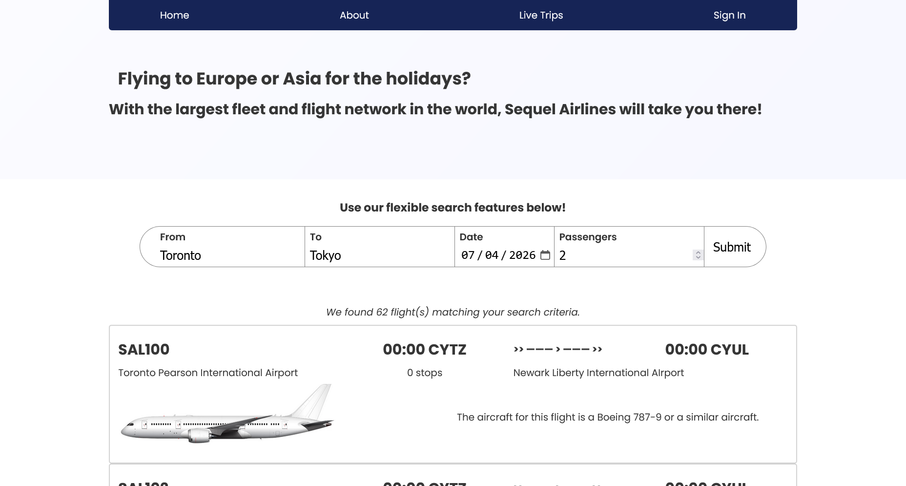
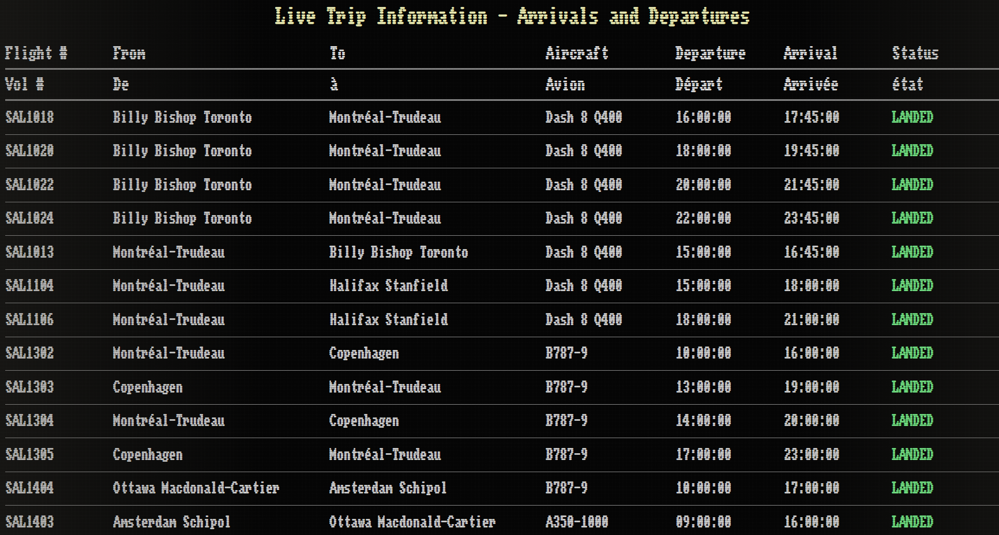

# Sequel Airlines Web Application

<p align="center">
<!-- Thank you to Kopna @ https://devicon.dev/ for these icons! -->


    


</p>

> A full-stack web application for a fictional airline, comprising of a React frontend, a Flask + GraphQL backend API, and an automated PostgreSQL database. 

# Overview






Airlines require complex algorithms and systems to manage their aircraft, their flights, and their trips. This projects aims to implement a full-stack solution with clear separation of concerns and user roles, while featuring a simple yet flexible query system and an automated yet performant database to handle trip scheduling, aircraft assignment, and trip updates.

## User Client
The client is implemented with React, using its routing and state features to streamline the user interface and experience.


## Backend API
The backend consists of a Flask API facing the user client, which it then translates into the appropriate GraphQL query. This adds an additional layer of abstraction between the users and the database and allows for quick changes to schemas and queries without any changes to the underlying database.

## Database
PostgreSQL offers all the necessary features, including procedural functions, triggers, crontabs, and strict security permissions to function as an independent, automated airline database. No business logic or query logic is needed in the backend server to update the data when required; this means that the backend simply queries while the database self-manages.

# Installation and Setup

Each of the three services are dockerized and are built together with ```docker compose```. They are designed to work on the same host.

# Sample Usage

This is a work-in-progress and I will update this once completed.
